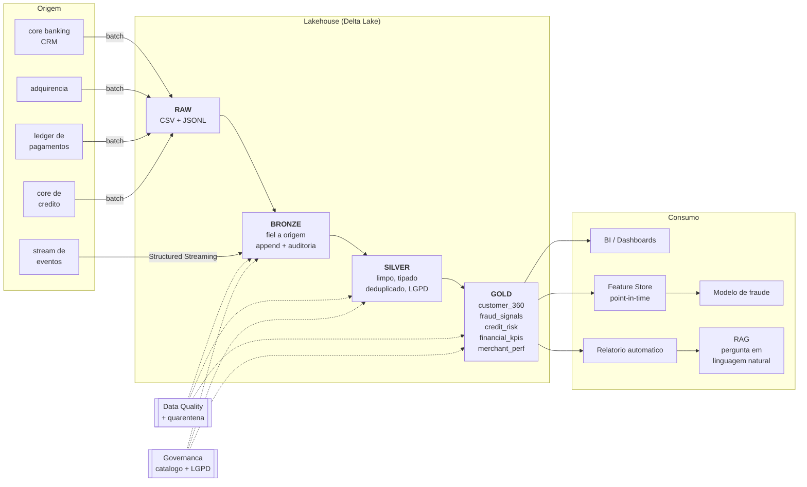

# 🏦 NeoPag Lakehouse — Data Lakehouse com Delta Lake para uma fintech

[](https://www.python.org/)
[](https://spark.apache.org/)
[](https://delta.io/)
[](https://airflow.apache.org/)
[](https://scikit-learn.org/)
[](LICENSE)

> **Pipeline de dados ponta a ponta de uma fintech ficticia**: ingestao batch e
> streaming, arquitetura Medallion sobre Delta Lake, tabelas Gold para risco de
> credito, antifraude e KPIs financeiros, feature store com correcao
> point-in-time, modelo de deteccao de fraude e uma camada de IA generativa
> (RAG) que responde perguntas de negocio em linguagem natural.
>
> **Roda inteiro na sua maquina com um comando.** Sem cloud, sem chave de API.

---

## 📌 Indice

- [O problema](#-o-problema)
- [O que este projeto entrega](#-o-que-este-projeto-entrega)
- [Arquitetura](#-arquitetura)
- [Stack](#-stack)
- [Como rodar](#-como-rodar)
- [Estrutura do projeto](#-estrutura-do-projeto)
- [As camadas em detalhe](#-as-camadas-em-detalhe)
- [Recursos do Delta Lake demonstrados](#-recursos-do-delta-lake-demonstrados)
- [Machine Learning](#-machine-learning)
- [Engenharia de IA (RAG)](#-engenharia-de-ia-rag)
- [Governanca e qualidade](#-governanca-e-qualidade)
- [Decisoes de engenharia](#-decisoes-de-engenharia)
- [O que mudaria em producao](#-o-que-mudaria-em-producao)
- [Documentacao](#-documentacao)

---

## 🎯 O problema

A **NeoPag** e uma fintech ficticia de pagamentos e credito. Sobre os mesmos
dados, a empresa precisa responder perguntas de naturezas muito diferentes:

| Pergunta | Latencia | Quem consome |
|---|---|---|
| "Essa transacao e fraude?" | milissegundos | motor de decisao |
| "Qual o TPV de ontem?" | minutos | dashboard executivo |
| "A safra de marco esta pior que a de fevereiro?" | horas | comite de credito |
| "Quais features usar no modelo de risco?" | dias | ciencia de dados |

A arquitetura tradicional resolve isso com **dois sistemas** — um data lake para
o dado bruto e ML, um data warehouse para BI — e paga o preco: pipelines
duplicados, dados que divergem e a eterna discussao sobre "qual numero esta
certo".

O **Lakehouse** elimina a duplicacao: uma unica copia do dado, em formato aberto
(Parquet) sobre storage barato, com uma camada de metadados transacional
(**Delta Lake**) que entrega o que faltava ao data lake — ACID, schema
enforcement, time travel e performance de warehouse.

Este projeto implementa essa arquitetura inteira, do dado sintetico ao RAG.

---

## ✨ O que este projeto entrega

| # | Entrega | Onde |
|---|---|---|
| 1 | **Gerador de dados sinteticos** com comportamento realista: perfis de gasto, 4 padroes distintos de fraude, inadimplencia correlacionada a risco e ~3% de registros sujos de proposito | `src/generators/` |
| 2 | **Ingestao batch + streaming** escrevendo na *mesma* tabela Delta | `src/bronze/` |
| 3 | **Arquitetura Medallion** completa (Bronze / Silver / Gold) | `src/bronze/`, `src/silver/`, `src/gold/` |
| 4 | **5 tabelas Gold** de negocio: cliente 360, sinais de fraude, carteira de credito, KPIs financeiros e performance de lojistas | `src/gold/` |
| 5 | **Framework de Data Quality** com quarentena de registros rejeitados | `src/common/data_quality.py` |
| 6 | **Feature Store** com correcao point-in-time | `src/ml/feature_store.py` |
| 7 | **Modelo de fraude** com split temporal, PR-AUC e ponto de operacao escolhido por custo | `src/ml/train_fraud_model.py` |
| 8 | **Relatorio analitico automatico** gerado a partir dos fatos da Gold | `src/ai/insight_generator.py` |
| 9 | **Pipeline RAG** com vector store em Delta e citacao de fonte | `src/ai/rag_pipeline.py` |
| 10 | **Orquestracao**: runner Python + DAG do Airflow gerado do mesmo grafo | `orchestration/` |
| 11 | **Governanca como codigo**: catalogo declarativo, LGPD, geracao do setup de Unity Catalog | `src/governance/` |
| 12 | **Manutencao Delta**: OPTIMIZE, Z-ORDER, VACUUM + demo de time travel, MERGE e RESTORE | `src/maintenance/` |

---

## 🏗 Arquitetura



<details>
<summary>Versao em texto (para quem esta lendo fora do GitHub)</summary>

```
   ORIGEM             RAW           BRONZE          SILVER            GOLD            CONSUMO
 -------------    -----------    ------------   -------------   ---------------   ---------------
 core banking  ->                                                customer_360   ->  BI/Dashboard
 adquirencia   ->  CSV mensal ->  Delta bruto -> Delta limpo ->  fraud_signals  ->  Feature Store
 ledger        ->  JSONL      ->  (append)    -> (dedup,      ->  credit_risk    ->  Modelo de ML
 stream        ->  eventos    ->  STRING +    ->  tipado,     ->  financial_kpis ->  Insights IA
 core credito  ->                 auditoria   ->  enriquecido)->  merchant_perf  ->  RAG

                                       |               |                |
                                       +------- Data Quality -----------+
                                       +------- Governanca -------------+
```
</details>

O detalhamento das decisoes esta em **[`docs/architecture.md`](docs/architecture.md)**.

---

## 🛠 Stack

| Camada | Tecnologia | Por que |
|---|---|---|
| Processamento | **Apache Spark 3.5 (PySpark)** | Padrao de mercado para dado distribuido; o mesmo codigo roda local e em cluster |
| Formato de tabela | **Delta Lake 3.2** | ACID, time travel, schema evolution e `MERGE` sobre Parquet — sem lock-in |
| Linguagem | **Python 3.10+ e SQL** | |
| Orquestracao | **Airflow 2.9** + runner Python proprio | O DAG do Airflow e gerado do mesmo grafo do runner: uma definicao so |
| ML | **scikit-learn** (XGBoost opcional) | Gradient boosting e o estado da arte para tabular |
| IA generativa | **TF-IDF + SVD** local, adaptador para **Anthropic** | Roda offline; trocar por um provider real e mudar uma classe |
| Governanca | **YAML declarativo** -> `TBLPROPERTIES` / **Unity Catalog** | Catalogo versionado no Git, aplicado pelo pipeline |
| Qualidade | Framework proprio (~250 linhas) | Expectativas por tabela + quarentena, resultados persistidos em Delta |

**Onde roda:** maquina local (Spark em `local[*]`), Databricks Community Edition
ou qualquer cluster Spark. Zero dependencia de servico pago.

---

## 🚀 Como rodar

### Pre-requisitos

- Python 3.10+
- Java 17 ou 21 (requisito do Spark) — `java -version` para conferir
- ~4 GB de RAM livres e ~2 GB de disco

### Instalacao

```bash
git clone https://github.com/AbnerRidigolo/delta-lake-e-lakehouse.git
cd delta-lake-e-lakehouse

python -m venv .venv
source .venv/bin/activate          # Windows: .venv\Scripts\activate
pip install -r requirements.txt
```

> Na primeira execucao o Spark baixa os JARs do Delta Lake via Maven (~30 s).

### Execucao completa

```bash
make pipeline
# ou, sem make:
PYTHONPATH=. python -m orchestration.run_pipeline
```

Isso executa as 18 etapas na ordem correta: geracao dos dados -> Bronze ->
Silver -> Gold -> feature store -> modelo -> relatorio -> indice RAG ->
governanca -> manutencao. **Tempo total: ~12 minutos** em um notebook comum.

### Execucao por partes

```bash
make data          # so os dados sinteticos
make bronze        # ingestao batch + streaming
make silver        # limpeza e enriquecimento
make gold          # tabelas de negocio
make ml            # feature store + treino do modelo
make ai            # relatorio automatico + indice RAG
make demo          # time travel, schema evolution, MERGE, RESTORE, constraints
make test          # testes automatizados
make help          # lista todos os alvos
```

Controle fino do pipeline:

```bash
python -m orchestration.run_pipeline --list                    # ve o DAG
python -m orchestration.run_pipeline --from silver_transactions
python -m orchestration.run_pipeline --only gold_customer_360
python -m orchestration.run_pipeline --skip generate_data
```

### Perguntando aos dados (RAG)

```bash
python -m src.ai.rag_pipeline --ask "Como esta a inadimplencia da carteira?"
python -m src.ai.rag_pipeline --demo     # bateria de perguntas prontas
```

### Consultando com SQL

```python
from src.common.spark_session import get_spark

spark = get_spark("analise")
spark.sql("""
    SELECT segment, count(*) AS clientes,
           round(avg(customer_score)) AS score_medio,
           round(sum(tpv_90d), 2)     AS tpv_90d
    FROM gold.customer_360
    WHERE is_churn_risk = false
    GROUP BY segment ORDER BY tpv_90d DESC
""").show()
```

### Rodando no Databricks Community Edition

1. Crie um cluster (Runtime 14.x ou superior — ja vem com Spark e Delta).
2. Importe `notebooks/databricks_lakehouse_demo.py` como notebook.
3. Ajuste `paths.root` em `config/settings.yaml` para um caminho do DBFS
   (ex.: `/dbfs/FileStore/neopag`) ou defina `LAKEHOUSE_ROOT`.
4. Em `config/settings.yaml`, mude `project.environment` para `databricks` —
   as tabelas passam a usar o namespace de 3 niveis do Unity Catalog.

---

## 📁 Estrutura do projeto

```
delta-lake-e-lakehouse/
├── config/
│   ├── settings.yaml                    # caminhos, Spark, regras de negocio, ML, IA
│   └── catalog.yaml                     # catalogo declarativo (governanca como codigo)
│
├── src/
│   ├── common/                          # base compartilhada
│   │   ├── config.py                    # configuracao + resolucao de caminhos
│   │   ├── spark_session.py             # SparkSession com Delta (local ou Databricks)
│   │   ├── delta_io.py                  # escrita/leitura Delta, auditoria, time travel
│   │   ├── transforms.py                # cast seguro, dedup, normalizacao, mascaramento
│   │   ├── data_quality.py              # framework de expectativas
│   │   └── logging_utils.py
│   │
│   ├── generators/
│   │   ├── generate_synthetic_data.py   # gerador da fintech (clientes, transacoes, credito)
│   │   └── reference_data.py            # MCCs, cidades, segmentos, produtos
│   │
│   ├── bronze/
│   │   ├── schemas.py                   # contratos de schema (tudo STRING)
│   │   ├── bronze_ingestion.py          # ingestao batch idempotente
│   │   └── bronze_transactions_stream.py# Structured Streaming
│   │
│   ├── silver/
│   │   ├── silver_customers.py          # dedup, LGPD, derivacoes
│   │   ├── silver_merchants.py          # taxonomia de MCC
│   │   ├── silver_transactions.py       # a tabela de fatos central
│   │   ├── silver_credit_contracts.py   # faixas de atraso, provisao, safra
│   │   └── quarantine.py                # registros rejeitados com motivo
│   │
│   ├── gold/
│   │   ├── gold_customer_360.py         # RFM + credito + churn + score
│   │   ├── gold_transaction_fraud_signals.py  # 10 regras + velocity + decisao
│   │   ├── gold_credit_risk_portfolio.py      # PD, LGD, EAD, perda esperada
│   │   ├── gold_financial_kpis_daily.py       # DRE diaria da fintech
│   │   └── gold_merchant_performance.py       # TPV, chargeback, saude do lojista
│   │
│   ├── ml/
│   │   ├── feature_store.py             # feature views + join point-in-time
│   │   └── train_fraud_model.py         # treino, avaliacao e ponto de operacao
│   │
│   ├── ai/
│   │   ├── insight_generator.py         # extracao de fatos + relatorio Markdown
│   │   └── rag_pipeline.py              # chunking, embeddings, retrieval, LLM
│   │
│   ├── governance/
│   │   └── apply_catalog_metadata.py    # YAML -> TBLPROPERTIES + docs + UC SQL
│   │
│   └── maintenance/
│       ├── delta_maintenance.py         # OPTIMIZE / Z-ORDER / VACUUM
│       └── delta_features_demo.py       # time travel, MERGE, RESTORE, constraints
│
├── orchestration/
│   ├── run_pipeline.py                  # DAG como dado + runner com retry
│   └── airflow/dags/
│       └── lakehouse_medallion_dag.py   # DAG gerado do mesmo grafo
│
├── notebooks/
│   └── databricks_lakehouse_demo.py     # notebook para Databricks
│
├── docs/
│   ├── architecture.md                  # decisoes de arquitetura
│   ├── data_dictionary.md               # dicionario de dados
│   ├── governance.md                    # catalogo, LGPD, qualidade, linhagem
│   ├── linkedin_post.md                 # texto pronto para publicar
│   └── generated/                       # catalogo e SQL do Unity Catalog (gerados)
│
├── tests/test_pipeline.py               # testes das regras criticas
│
├── data/                                # camadas do lakehouse (geradas, fora do Git)
│   ├── raw/ bronze/ silver/ gold/
│   ├── feature_store/ vector_store/ quality/
│   └── _checkpoints/
│
├── Makefile
└── requirements.txt
```

---

## 🥉🥈🥇 As camadas em detalhe

### 🥉 Bronze — fidelidade a origem

**Regra unica: nao transformar nada.** Todas as colunas entram como `STRING`.

Parece contraintuitivo, mas e a decisao correta: um `amount` que chega como
`"N/A"` viraria `NULL` silencioso no cast automatico. Como string, o valor
invalido e preservado e vira evidencia — a Silver o rejeita explicitamente e o
contabiliza.

- `append`-only com **carga idempotente** por `replaceWhere` na particao do dia
- Particao por `_ingestion_date` (nao pela data do evento, que pode vir corrompida)
- `mergeSchema = true`: coluna nova na origem nao quebra o job
- Linhagem por linha: `_source_file`, `_ingested_at`, `_pipeline_run_id`
- **Batch e streaming escrevem na mesma tabela** — o ACID do Delta garante que
  isso e seguro

### 🥈 Silver — dado confiavel

1. **Deduplicacao** com janela ordenada (nao `dropDuplicates`, que escolhe uma
   linha arbitraria) — deterministica e auditavel
2. **Tipagem segura** com `try_cast`: valor invalido vira `NULL`, nao excecao
3. **Normalizacao**: `"  POS "`, `"Pos\t"` e `"pos"` viram `pos`
4. **Integridade referencial**: transacao com cliente inexistente vai para a quarentena
5. **LGPD**: CPF/e-mail mascarados, `customer_key` = SHA-256 com salt
6. **Enriquecimento** com as dimensoes via broadcast join

> **Quarentena em vez de descarte.** Todo registro rejeitado vai para
> `silver/_quarantine/<tabela>` com o motivo. Quando o negocio pergunta "por que
> o faturamento caiu 4%?", a resposta esta a uma query de distancia.

### 🥇 Gold — orientada a negocio

| Tabela | Grao | Responde |
|---|---|---|
| `customer_360` | cliente | Quem e, quanto vale, qual o risco, vai embora? |
| `transaction_fraud_signals` | transacao | E suspeita? Por qual regra? Qual acao tomar? |
| `credit_risk_portfolio` | safra x produto x faixa | A originacao piorou? Qual a perda esperada? |
| `financial_kpis_daily` | dia | Quanto entrou, quanto perdemos, qual o resultado? |
| `merchant_performance` | lojista x mes | Quais lojistas dao lucro e quais dao prejuizo? |

**Destaques de modelagem:**

- **`customer_score` (0–1000)** — regra transparente e auditavel: parte de 1000 e
  desconta por faixa de risco, atraso, NPL, comprometimento de renda, fraude e
  inatividade; soma bonus por tempo de casa e engajamento. E o baseline que uma
  area de risco usa como sanity check do modelo estatistico.
- **Motor de fraude com 10 regras ponderadas** — velocity, dispositivo novo,
  dispersao, outlier no lojista, salto geografico, madrugada... com score 0–100 e
  acao recomendada (`aprovar` / `autenticar_2fa` / `revisar_manualmente` / `bloquear`).
- **Perda esperada = EAD x PD x LGD** (Basileia simplificado), com LGD por
  produto: consignado 25%, capital de giro 55%, pessoal 65%, BNPL 80%, rotativo 85%.
- **DRE diaria**: receita (MDR + juros) − perdas (chargeback + fraude + write-off)
  + recuperacao = resultado liquido.

---

## 💎 Recursos do Delta Lake demonstrados

| Recurso | Onde | Para que |
|---|---|---|
| **ACID** | todas as escritas | Batch e streaming na mesma tabela sem corromper |
| **Time travel** | `delta_features_demo.py` | Auditoria, reproducao de treino, rollback |
| **Schema evolution** | Bronze (`mergeSchema`) | Absorver coluna nova sem quebrar |
| **Schema enforcement** | Silver / Gold | Impedir que o schema errado entre |
| **`replaceWhere`** | Bronze e Silver | Reprocessar um dia sem reescrever o ano |
| **`MERGE` (upsert)** | `delta_features_demo.py` | Correcao tardia, CDC, SCD |
| **`RESTORE`** | `delta_features_demo.py` | Desfazer escrita ruim em um comando |
| **`CHECK` constraint** | `delta_features_demo.py` | Qualidade garantida pelo storage |
| **`OPTIMIZE` / `ZORDER`** | `delta_maintenance.py` | Compactacao e data skipping |
| **`VACUUM`** | `delta_maintenance.py` | Controle de custo de storage |
| **`DESCRIBE HISTORY` + `userMetadata`** | `delta_io.py` | Auditoria por commit |

```bash
make demo   # roda todos, com explicacao passo a passo
```

---

## 🤖 Machine Learning

### Feature Store com correcao point-in-time

O erro que mais mata modelo em producao e treinar com informacao que so
existiria **depois** do evento. A metrica offline fica linda e o modelo desaba
no dia 1.

A solucao aqui: as features de cliente sao **snapshots mensais acumulados**. A
linha `(cliente, 2024-06)` so enxerga transacoes ate 30/06. Uma transacao de
julho e enriquecida com o snapshot de **junho** — nunca com o do proprio mes.

O join e por chave, deterministico e auditavel. E ha um **teste automatizado**
que falha se algum registro violar essa regra:

```python
def test_feature_store_nao_vaza_informacao_do_futuro(spark):
    vazamentos = df.where(F.col("feature_month") >= F.date_format(F.col("event_date"), "yyyy-MM")).count()
    assert vazamentos == 0
```

### Modelo de fraude

| Decisao | Por que |
|---|---|
| **Split temporal**, nao aleatorio | Fraude evolui. Split aleatorio deixa o futuro no treino |
| **PR-AUC** como metrica principal | Com ~1% de positivos, ROC-AUC fica alta ate para modelo ruim |
| **Ponto de operacao por custo** | O limiar nao e 0.5: e o que maximiza `fraude barrada − custo de revisao` |
| **Baseline explicito** | Comparado ao motor de regras no mesmo teste. Modelo que nao bate a regra nao vai para producao |
| **Prefixos `tf_` / `cf_`** | Feature entra no modelo por convencao de nome — elimina uma classe inteira de vazamento acidental |
| **Score de volta ao lakehouse** | `feature_store.fraud_model_scores` fecha o ciclo para BI e monitoramento de drift |

O modelo usa XGBoost quando disponivel e cai automaticamente para
`HistGradientBoostingClassifier` do scikit-learn — o projeto roda em qualquer
ambiente sem dependencia extra.

---

## 🧠 Engenharia de IA (RAG)

### 1. Relatorio analitico automatico

```
Gold (Delta) ──> extracao de fatos (Spark) ──> JSON de fatos ──> relatorio Markdown
```

O modulo separa **extracao de fatos** (query Spark, deterministica, auditavel)
de **redacao** (template ou LLM). Essa separacao e o que torna o resultado
confiavel: **o numero sempre vem de uma query, nunca da "memoria" de um modelo.**

O relatorio traz fechamento do periodo, comparacao mes a mes, deteccao de
anomalias por **z-score robusto (mediana + MAD)**, diagnostico de credito por
safra, desempenho do antifraude e recomendacoes acionaveis.

> Por que MAD e nao desvio padrao? Porque a propria anomalia contamina a media —
> o metodo classico esconde justamente o que deveria encontrar.

### 2. Pipeline RAG

```
fatos ──> chunking semantico ──> embeddings ──> vector store (tabela Delta)
                                                        │
                          pergunta ──> retrieval top-k ─┘
                                            │
                                            v
                              LLM (mock offline | Anthropic)
                                            │
                                            v
                              resposta COM citacao da fonte
```

Duas decisoes que valem destaque:

- **O vector store e uma tabela Delta.** Versionamento e time travel valem
  tambem para embeddings: reindexar e um commit, e da para voltar ao indice
  anterior se a qualidade da recuperacao cair.
- **Cada chunk carrega a tabela de origem.** A resposta cita a fonte — requisito
  basico em contexto financeiro, onde "confie em mim" nao existe.

```bash
$ python -m src.ai.rag_pipeline --ask "Qual canal de pagamento concentra mais fraude?"

Intencao detectada: ranking (boost aplicado a 5 documentos)

**Resposta baseada nos dados da camada Gold:**

1. Ranking dos canais de pagamento com MAIS fraude, do maior para o menor. O canal
   com a maior taxa de fraude e o 'ecommerce', com 2,740% das transacoes
   fraudulentas. O canal mais seguro e o 'atm'. Ranking completo: 1o ecommerce
   com 2,740% (1772 casos, R$ 2.707.481,19); 2o wallet com 0,817% (179 casos,
   R$ 1.306.321,20); 3o pos com 0,764% (606 casos, R$ 717.120,79); (...)
   _(fonte: `gold.transaction_fraud_signals` - relevancia 0.9260)_
```

### O problema de recuperacao que apareceu — e como foi resolvido

A primeira versao retornava, para essa mesma pergunta, os canais com fraude
**zero**. Nao era bug: e o modo de falha classico da busca vetorial em
perguntas com superlativo. Os chunks de *todos* os canais compartilham o
vocabulario da pergunta ("canal de pagamento", "fraude"), entao a similaridade
fica praticamente empatada e o topo e decidido por ruido.

A correcao tem duas partes — e nenhuma delas e "trocar o modelo de embedding":

1. **Na indexacao:** precomputar **documentos de ranking** e de panorama
   consolidado, que ja respondem a pergunta agregada.
2. **Na recuperacao:** detectar a intencao da pergunta (`mais`, `maior`, `pior`,
   `ranking`...) e priorizar esses documentos — uma **recuperacao hibrida**
   simples, o mesmo principio de BM25 + vetor + reranking em producao.

O `MockLLM` roda offline e nao inventa nada: monta a resposta a partir do
contexto recuperado. Com `ANTHROPIC_API_KEY` definida e
`ai.llm_provider: anthropic` no YAML, o mesmo contexto vai para um LLM com um
system prompt que proibe estimar numeros fora do contexto.

---

## 🛡 Governanca e qualidade

### Catalogo declarativo

```
config/catalog.yaml            (fonte da verdade, versionada no Git)
        ├──> TBLPROPERTIES nas tabelas Delta
        ├──> docs/generated/data_catalog.md
        └──> docs/generated/unity_catalog_setup.sql
```

Cada tabela declara dominio, **owner**, **steward**, classificacao
(`PUBLIC` / `INTERNAL` / `CONFIDENTIAL` / `PII`), SLA e colunas de dado pessoal.
O pipeline aplica tudo automaticamente — nenhum passo manual, nenhum catalogo
desatualizado.

### LGPD por camada

| Camada | Tratamento |
|---|---|
| Bronze | Dado pessoal **cru**, acesso restrito (mascarar aqui destruiria a auditoria) |
| Silver | CPF e e-mail **mascarados**; `customer_key` = SHA-256 com salt |
| Gold / Feature Store | Nenhuma coluna de identificacao direta |

Direito ao esquecimento com Delta e uma operacao, nao um projeto:
`DELETE FROM ... WHERE customer_id = ...` seguido de `VACUUM`.

### Data Quality

Framework proprio com 7 tipos de expectativa (`not_null`, `unique`,
`allowed_values`, `between`, `regex`, `row_count_min`, `freshness`), severidade
(`error` derruba o pipeline, `warn` registra) e tolerancia configuravel.

Os resultados sao persistidos em `data/quality/dq_results` — o que permite montar
um **painel historico de qualidade** em vez de so um log que ninguem le.

Detalhes em **[`docs/governance.md`](docs/governance.md)**.

---

## 📊 Resultados da execucao de referencia

Numeros de uma execucao completa (`make pipeline`, ~12 min, seed 42). Todos os
valores sao **sinteticos** — servem para mostrar que o pipeline produz metricas
coerentes de ponta a ponta.

### Volume processado

| Camada | Volume |
|---|---|
| Raw | 261.693 transacoes (batch) + 10.034 eventos (streaming) |
| Bronze | 271.727 transacoes, 5.020 clientes, 6.515 contratos, 400 lojistas |
| Silver | 262.952 transacoes validas · **21.439 registros em quarentena** |
| Gold | 4.957 clientes · 262.952 transacoes pontuadas · 559 safras · 366 dias |
| Feature Store | 43.520 snapshots mensais + 262.952 linhas de treino |
| Vector store | 77 chunks indexados |

**Quarentena** (o que a Silver rejeitou e por que):

| Motivo | Registros |
|---|---|
| Cliente inexistente no cadastro | 11.602 |
| Timestamp invalido | 4.818 |
| Valor nao numerico | 3.293 |
| Valor nao positivo | 1.726 |

### Negocio

| Indicador | Valor |
|---|---|
| TPV do periodo | R$ 102,5 mi |
| Receita total | R$ 17,7 mi (R$ 2,5 mi de MDR + R$ 15,2 mi de juros) |
| Perdas | R$ 7,4 mi · Recuperacao R$ 176 mil |
| Resultado liquido | R$ 10,5 mi (margem 59%) |
| Taxa de aprovacao | 94,2% |
| EAD da carteira | R$ 80,3 mi · **NPL 6,7%** · cobertura 1,17x |
| Perda esperada | R$ 1,93 mi |
| Base de clientes | 4.957 · **10,0% em risco de churn** · score medio 880 |
| Fraude | 2.744 transacoes (1,04%) · R$ 6,2 mi |

### Antifraude: regras vs. modelo

| | Motor de regras | Modelo (HistGradientBoosting) |
|---|---|---|
| Precisao | 43,3% | 66,6% |
| Recall | 14,0% | 99,5% |
| Taxa de revisao manual | 0,34% | 1,56% |
| PR-AUC | — | **0,930** |

O modelo captura muito mais fraude ao custo de mais revisao manual — e o
**ponto de operacao foi escolhido por essa conta**, nao por um limiar arbitrario.

---

## 🧩 Decisoes de engenharia

Algumas escolhas que diferenciam este projeto de um tutorial:

**1. O dataset sintetico foi calibrado contra vazamento — tres vezes.**

Na primeira versao, o modelo atingiu **recall de 100%**. Isso nao e vitoria, e
sintoma. Cada rodada de investigacao achou um oraculo diferente escondido no
proprio gerador:

| Vazamento encontrado | Diagnostico | Correcao |
|---|---|---|
| `txn_count_10min` | Nenhuma transacao legitima tinha duas compras em 10 min — "velocity alta" separava fraude perfeitamente | Sessoes de compra, retentativas apos recusa e sessoes longas no comportamento legitimo |
| `is_new_device` | Cliente legitimo nunca trocava de aparelho | 4,5% das compras legitimas partem de um dispositivo novo |
| `merchant_risk_score` | O score do lojista era **derivado da verdade de conluio** — um oraculo, nao uma estimativa | Score ruidoso: so 60% dos lojistas em conluio sao detectados e 8% dos honestos recebem score alto sem motivo |

Somou-se ainda **8% de fraude nunca reportada** (rotulo ruidoso, como na vida
real). O metodo foi sempre o mesmo: medir a taxa de fraude condicionada a cada
feature e procurar a que fosse determinista.

> ⚠️ **Limitacao honesta:** mesmo apos as correcoes, o PR-AUC de 0,93 e mais alto
> do que um modelo de fraude alcanca em producao. A razao e estrutural: a fraude
> aqui vem de **quatro padroes parametricos** e nenhum gerador sintetico
> reproduz a ambiguidade do mundo real. O valor do projeto esta no **metodo** —
> point-in-time, split temporal, PR-AUC, baseline e ponto de operacao por custo —
> nao no numero.

**2. Bronze guarda tudo como STRING.**
Contraintuitivo, mas preserva a evidencia do erro em vez de transformar dado
invalido em `NULL` silencioso.

**3. Nada e descartado em silencio.**
Registro rejeitado vai para a quarentena com o motivo. Isso transforma
"o faturamento caiu e ninguem sabe por que" em uma query.

**4. Uma unica definicao de DAG.**
O grafo vive em `orchestration/run_pipeline.py`; o DAG do Airflow e gerado a
partir dele. Duas definicoes divergem — e sempre no pior momento.

**5. Particionamento e Z-ORDER escolhidos por padrao de acesso.**
E o codigo documenta a pegadinha: o Delta so coleta estatisticas das **32
primeiras colunas**, entao Z-ORDER em coluna posterior nao gera data skipping
(o proprio Delta rejeita a operacao).

**6. Idempotencia de verdade.**
Rodar o pipeline duas vezes no mesmo dia produz o mesmo resultado —
`replaceWhere` na particao do dia, checkpoint de streaming resetado junto com a
origem e deduplicacao na Silver.

---

## 🔭 O que mudaria em producao

| Componente | Aqui | Em producao |
|---|---|---|
| Ingestao streaming | Diretorio JSONL | Kafka / Auto Loader |
| Orquestracao | Runner Python + Airflow | Airflow / Databricks Workflows / Dagster |
| Catalogo | YAML + `TBLPROPERTIES` | Unity Catalog ou DataHub |
| Data Quality | Framework proprio | Great Expectations / Soda / DLT expectations |
| Embeddings | TF-IDF + SVD local | Voyage, OpenAI ou BGE |
| Vector store | Tabela Delta + busca exata | pgvector, Qdrant, Databricks Vector Search |
| Registro de modelo | `joblib` + JSON | MLflow Model Registry |
| Features online | Leitura da tabela offline | Redis / DynamoDB |
| Storage | Disco local | S3 / ADLS Gen2 com lifecycle |

**A arquitetura nao muda** — trocam-se implementacoes de componentes com
interfaces ja isoladas no codigo.

---

## 📚 Documentacao

| Documento | Conteudo |
|---|---|
| [`docs/architecture.md`](docs/architecture.md) | Decisoes de arquitetura, particionamento, trade-offs |
| [`docs/data_dictionary.md`](docs/data_dictionary.md) | Dicionario de dados completo, coluna a coluna |
| [`docs/governance.md`](docs/governance.md) | Catalogo, LGPD, qualidade, linhagem, retencao |
| [`docs/generated/data_catalog.md`](docs/generated/) | Catalogo gerado automaticamente pelo pipeline |
| [`docs/linkedin_post.md`](docs/linkedin_post.md) | Texto pronto para publicar |
| [`reports/`](reports/) | Relatorio analitico gerado pela camada de IA |

---

## 👤 Autor

**Abner Ridigolo** — Engenharia de Dados, Ciencia de Dados e IA, com foco em
Financas Quantitativas.

[](https://www.linkedin.com/)

> Os dados deste projeto sao **inteiramente sinteticos**, gerados por
> `src/generators/`. Nomes, documentos, estabelecimentos e transacoes sao
> ficticios e nao correspondem a pessoas ou empresas reais.

---

<p align="center">
  <sub>Se este projeto te ajudou, deixe uma ⭐ — ajuda outras pessoas a encontrarem.</sub>
</p>
