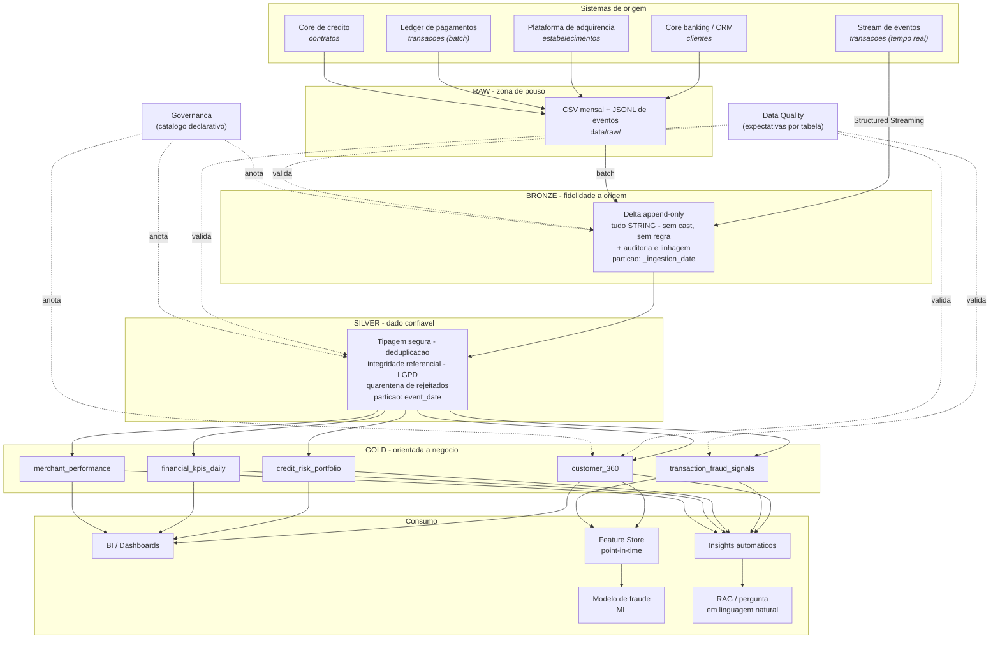

# Arquitetura do Lakehouse

> Documento de arquitetura do projeto **NeoPag Lakehouse**: as decisoes tomadas,
> o porque de cada uma e o que mudaria em um ambiente de producao real.

---

## 1. O problema

Uma fintech de pagamentos e credito precisa responder, sobre os mesmos dados,
perguntas com naturezas completamente diferentes:

| Pergunta | Latencia aceitavel | Consumidor |
|---|---|---|
| "Essa transacao e fraude?" | milissegundos | motor de decisao |
| "Qual o TPV de ontem?" | minutos | dashboard executivo |
| "A safra de marco esta pior que a de fevereiro?" | horas | comite de credito |
| "Quais features usar no modelo de risco?" | dias | ciencia de dados |

A arquitetura tradicional resolve isso com **dois sistemas**: um data lake
(barato, flexivel, sem garantias) para o dado bruto e ciencia de dados, e um
data warehouse (caro, rigido, transacional) para BI. O custo dessa escolha e
alto: pipelines duplicados, dado que diverge entre os dois mundos e uma
discussao infinita sobre "qual numero esta certo".

O **Lakehouse** elimina a duplicacao: uma unica copia do dado, em formato aberto
(Parquet) sobre storage barato (S3/ADLS/disco), com uma camada de metadados
transacional por cima (Delta Lake) que entrega o que faltava ao data lake —
ACID, schema enforcement, time travel e performance de warehouse.

---

## 2. Visao geral



### Versao em texto

```
   ORIGEM              RAW            BRONZE          SILVER            GOLD             CONSUMO
 ------------      -----------     ------------    -------------   ---------------   ---------------
 core banking  ->                                                   customer_360   ->  BI/Dashboard
 adquirencia   ->   CSV mensal  ->  Delta bruto  -> Delta limpo ->  fraud_signals  ->  Feature Store
 ledger        ->   JSONL       ->  (append)     -> (dedup,      ->  credit_risk    ->  Modelo ML
 stream        ->   eventos     ->  STRING +     ->  tipado,     ->  financial_kpis ->  Insights IA
 core credito  ->                   auditoria    ->  enriquecido)->  merchant_perf  ->  RAG
                                          |               |                |
                                          +-------- Data Quality ----------+
                                          +-------- Governanca ------------+
```

---

## 3. As camadas, e o criterio de cada uma

### RAW — zona de pouso

Arquivos como saem da origem. Nao e uma camada Delta: e o "recibo" de que o dado
chegou. Serve para reprocessar tudo do zero se a Bronze for corrompida.

Formatos deliberadamente diferentes para exercitar os dois caminhos de ingestao:
CSV mensal (batch) e JSONL em micro-lotes (streaming).

### BRONZE — fidelidade a origem

**Regra unica: nao transformar nada.**

| Decisao | Por que |
|---|---|
| Todas as colunas como `STRING` | Um `amount` vindo como `"N/A"` viraria `NULL` silencioso no cast automatico. Como string, o valor invalido e preservado e vira evidencia — a Silver o rejeita explicitamente e o contabiliza. |
| `append`, nunca `overwrite` (transacoes) | Bronze e um log de chegadas. Sobrescrever destroi a capacidade de auditar o que foi recebido e quando. |
| Particao por `_ingestion_date` | Permite reprocessar "a carga de terca" sem tocar no resto. Particionar por data do evento aqui seria arriscado: um timestamp corrompido criaria particoes lixo. |
| `mergeSchema = true` | Coluna nova na origem e absorvida sem quebrar o job. |
| Colunas `_source_file`, `_ingested_at`, `_pipeline_run_id` | Linhagem no nivel da linha: da para responder "de qual arquivo veio esta linha e qual execucao a gravou". |

**Batch e streaming escrevem na mesma tabela Delta.** Isso e o coracao do
Lakehouse: as garantias ACID do Delta permitem que dois processos concorrentes
escrevam sem corromper nada, e quem le nao precisa saber por qual caminho o dado
chegou.

### SILVER — dado confiavel

Onde o dado bruto vira fato analitico:

1. **Deduplicacao** com janela ordenada (nao `dropDuplicates`, que escolhe uma
   linha arbitraria) — mantem a versao mais recente, de forma deterministica.
2. **Tipagem segura** com `try_cast`: valor invalido vira `NULL` em vez de
   derrubar o job.
3. **Normalizacao** de categorias: `"  POS "`, `"Pos\t"` e `"pos"` viram `pos`.
4. **Integridade referencial**: transacao apontando para cliente inexistente nao
   entra — vai para a quarentena com o motivo.
5. **LGPD**: CPF e e-mail mascarados; hash com salt (`customer_key`) permite
   join sem expor dado pessoal.
6. **Enriquecimento** com as dimensoes (broadcast join, sem shuffle da fato).

**Quarentena em vez de descarte.** Todo registro rejeitado vai para
`silver/_quarantine/<tabela>` com o motivo. Quando o negocio pergunta "por que o
faturamento caiu 4%?", a resposta esta a uma query de distancia.

### GOLD — orientada a negocio

Cinco tabelas, cada uma desenhada para um consumidor especifico:

| Tabela | Grao | Responde |
|---|---|---|
| `customer_360` | cliente | Quem e o cliente, quanto vale, qual o risco, vai embora? |
| `transaction_fraud_signals` | transacao | Essa transacao e suspeita? Por qual regra? Qual acao tomar? |
| `credit_risk_portfolio` | safra x produto x faixa | A originacao piorou? Qual a perda esperada? |
| `financial_kpis_daily` | dia | Quanto entrou, quanto perdemos, qual o resultado? |
| `merchant_performance` | lojista x mes | Quais lojistas dao lucro e quais dao prejuizo? |

---

## 4. Particionamento e layout fisico

| Tabela | Particao | Z-ORDER | Racional |
|---|---|---|---|
| `bronze.transactions` | `_ingestion_date` | — | Reprocessamento por carga |
| `silver.transactions` | `event_date` | `customer_id, merchant_id` | Todo filtro analitico comeca por data; joins por cliente/lojista |
| `silver.credit_contracts` | `vintage` | `customer_id, product` | Analise de credito e sempre por safra |
| `gold.transaction_fraud_signals` | `event_date` | `customer_id, fraud_score_rule` | Investigacao filtra por cliente e por score |
| `gold.financial_kpis_daily` | `year_month` | `event_date` | Serie temporal lida por mes |
| `gold.customer_360` | `segment` | `customer_id, customer_score` | Campanhas segmentam por perfil |

**Regra pratica:** particione pela coluna que aparece no `WHERE` de quase toda
query e que tenha cardinalidade moderada; use Z-ORDER para as colunas de alta
cardinalidade que aparecem em filtros e joins. Nunca faca Z-ORDER na coluna de
particao — o particionamento ja resolveu aquilo.

**Small files.** Particionar por dia com pouco volume gera arquivos minusculos.
Mitigacoes aplicadas: `repartition` pela coluna de particao antes da escrita,
`optimizeWrite`/`autoCompact` ligados e `OPTIMIZE` no fim do pipeline.

---

## 5. Recursos do Delta Lake usados (e onde)

| Recurso | Onde | Para que |
|---|---|---|
| Transacoes ACID | todas as escritas | Batch e streaming na mesma tabela sem corromper |
| Time travel | `delta_features_demo.py` | Auditoria, reproducao de treino, rollback |
| Schema evolution | Bronze (`mergeSchema`) | Absorver mudanca de origem sem quebrar |
| Schema enforcement | Silver/Gold | Impedir que o schema errado entre |
| `replaceWhere` | `silver_transactions.py` | Reprocessar um dia sem reescrever o ano |
| `MERGE` | `delta_features_demo.py` | Correcao tardia / CDC / SCD |
| `RESTORE` | `delta_features_demo.py` | Desfazer escrita ruim em um comando |
| `CHECK` constraint | `delta_features_demo.py` | Qualidade garantida pelo storage |
| `OPTIMIZE` / `ZORDER` | `delta_maintenance.py` | Compactacao e data skipping |
| `VACUUM` | `delta_maintenance.py` | Controle de custo de storage |
| `DESCRIBE HISTORY` + `userMetadata` | `delta_io.py` | Trilha de auditoria por commit |

---

## 6. Camada de Machine Learning

```
silver.transactions ──> gold.transaction_fraud_signals ──> feature_store.transaction_features ─┐
                                                                                                ├──> modelo
silver.transactions ──────────────────────────────────> feature_store.customer_features ───────┘
                                                          (snapshot mensal acumulado)
```

**Point-in-time correctness** e a decisao central. As features de cliente sao
snapshots mensais acumulados; uma transacao de julho e enriquecida com o
snapshot de **junho**. Sem isso, o modelo aprenderia com informacao que so
existiria depois do evento — a metrica offline fica otima e o modelo desaba em
producao.

**Split temporal, nao aleatorio.** Treina no passado, testa no futuro.

**Metrica: PR-AUC.** Com ~1% de fraude, ROC-AUC fica alta ate para modelo ruim.

**Ponto de operacao por custo.** O limiar nao e 0.5: e o que maximiza
`valor de fraude barrado − custo de revisao manual`.

**Baseline explicito.** O modelo e comparado ao motor de regras no mesmo
conjunto de teste. Modelo que nao bate a regra nao vai para producao.

---

## 7. Camada de IA generativa

```
Gold ──> extracao de fatos (Spark) ──> JSON de fatos ──> relatorio Markdown
                                            │
                                            └──> chunking ──> embeddings ──> vector store (Delta)
                                                                                   │
                                              pergunta ──> recuperacao top-k ──────┘
                                                                │
                                                                v
                                                     LLM (mock offline ou Anthropic)
                                                                │
                                                                v
                                                  resposta COM citacao da fonte
```

Duas decisoes que importam:

1. **Separacao entre extracao de fatos e redacao.** Os numeros vem sempre de uma
   query Spark; o LLM so redige. Em contexto financeiro, alucinar uma taxa de
   inadimplencia e inaceitavel.
2. **O vector store e uma tabela Delta.** Versionamento e time travel valem
   tambem para embeddings: reindexar e um commit, e da para voltar ao indice
   anterior se a qualidade da recuperacao cair.

---

## 8. O que mudaria em producao

| Componente | Neste projeto | Em producao |
|---|---|---|
| Ingestao streaming | Diretorio JSONL + Structured Streaming | Kafka / Auto Loader |
| Orquestracao | Runner Python + DAG Airflow | Airflow / Databricks Workflows / Dagster |
| Catalogo | YAML + `TBLPROPERTIES` | Unity Catalog ou DataHub |
| Data Quality | Framework proprio (~250 linhas) | Great Expectations / Soda / DLT expectations |
| Embeddings | TF-IDF + SVD local | Voyage, OpenAI ou BGE |
| Vector store | Tabela Delta + busca exata | pgvector, Qdrant, Databricks Vector Search |
| Registro de modelo | `joblib` + JSON | MLflow Model Registry |
| Serving de features | Leitura da tabela offline | Feature store online (Redis/DynamoDB) |
| Storage | Disco local | S3 / ADLS Gen2 com lifecycle policy |

O ponto: **a arquitetura nao muda** — trocam-se implementacoes de componentes
com interfaces ja isoladas no codigo.
